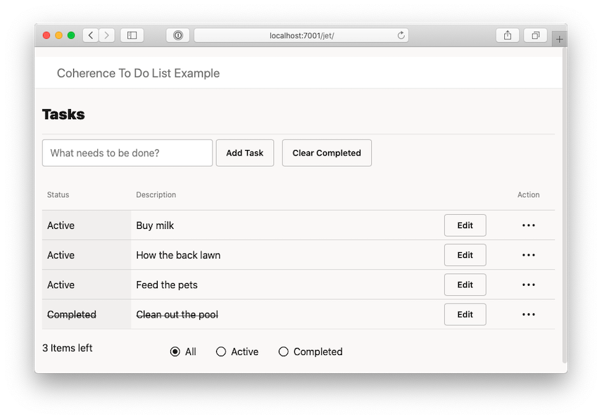

# Coherence To Do List Example Application

## Overview

This example is a simple task management application which allows users to add, complete,
filter and delete tasks within a list.

The example currently provides two clients to work with tasks:

1. React front-end integrating with a Helidon Microprofile back-end integrated 
   with Coherence using the `coherence-cdi` and `coherence-mp` modules.

1. JavaFX client connecting as a Coherence Java client 

2. Oracle JET Client (Otional)

Any number of the clients can be run and will receive all events from other clients as
tasks are created, updated, completed or removed. This is achieved using Server Sent Events 
(SSE) for React client and Coherence Live Events for the JavaFX client.

## Prerequisites

In order to build and run the examples, you must have the following installed:

* Maven 3.6.3+
* Java 11+
* NPM 6.14.4+
* Node.js 12.16.2+

## Build Instructions (React)

1. Initialize `npm`

    ```bash
    cd server/src/main/web/react
    npm install   
    ```           

1. Build the Project

    Run the following from the project root directory

    ```bash
    mvn clean install
    ```       

## Running the Example

1. Run the server

    ```bash  
    cd server
    mvn exec:exec
    ```            
   
1. Access the Web UI
  
   Access via http://localhost:7001/
   
   
   
1. Run the JavaFX Client

    ```bash  
    cd client
    mvn javafx:run
    ```  
        
    

## Build and Run the Oracle JET UI (Optional)

If you wish to run the Oracle JET UI, please carry out the following:

1. Install the JET CLI

    ```bash
    npm install -g ojet-cli
    ```   
   
1. Build JET UI
   
    ```bash
    cd server/src/main/web/jet
    npm install
    ojet build
    ```
            
1. Re-Build the Project

    Run the following from the project root directory:

    ```bash
    mvn clean install
    ```          

1. Access the Web UI

   Run the server as mentioned above and access the UI via http://localhost:7001/jet/   
   
   
    
## References

* [Coherence Community Edition](https://github.com/oracle/coherence)
* [Project Helidon](https://helidon.io/)
* [Coherence Community](https://coherence.community/)
* [Oracle JET CLI](https://github.com/oracle/ojet-cli)


