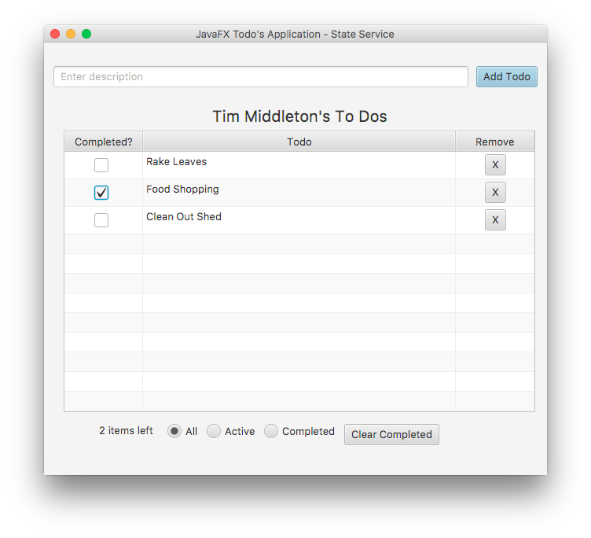

# ToDo Example JavaFX

### Build and Run the Example

Note: Ensure you are in the client directory.

1. Build the source.

    ```bash
    mvn -s settings.xml clean install -DskipTests
    ```
  
2. Run the example.

    ```bash
    mvn -s settings.xml exec:exec
    ```
 
3. If you want to change the username or the server url you can pass in
   something like the following:

   ```bash
   mvn -s settings.xml exec:exec "-Dusername=Default User" "-Durl=localhost:1408"
   ```  

   If you do not sepcify the user, the default is the current logged in user or `$USER`.

   The following screen should be displayed.
   
   
