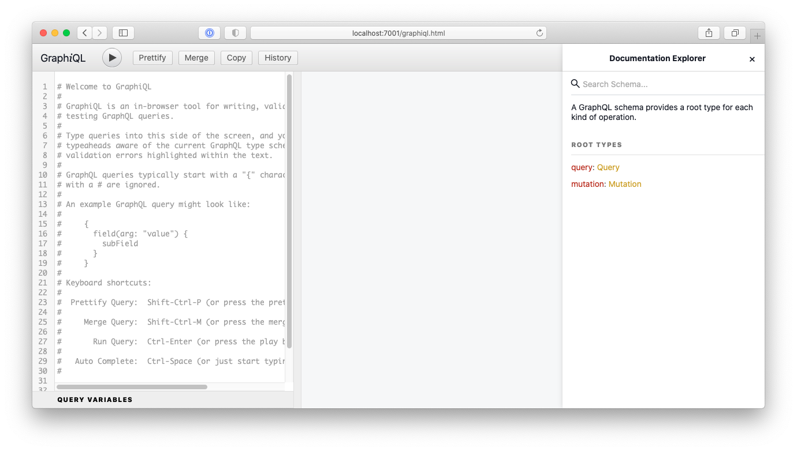

# Coherence To Do List Example Application - GraphQL Endpoint

## Overview

This document describes how to access the GraphQL endpoint for the To Do Application.

## What is GraphQL

From the [MicroProfile (MP) GraphQL spec](https://github.com/eclipse/microprofile-graphql) page:

GraphQL is an open-source data query and manipulation language for APIs, and a runtime for fulfilling 
queries with existing data. GraphQL interprets strings from the client, and returns data in an understandable, 
predictable, pre-defined manner. GraphQL is an alternative, though not necessarily a replacement for REST.

GraphQL provides three types of data operations: query, mutation and subscription. The schema is 
the core of GraphQL and clearly defines the operations supported by the API, 
including input arguments and possible responses.

## The TaskApi Class

The [TaskApi Class](server/src/main/java/com/oracle/coherence/examples/todo/server/TaskApi.java) has been
created and annotated with `@GraphQLApi` to identify it as a GraphQL endpoint. 

See the [Helidon Documentation](https://helidon.io/docs/v2/#/mp/graphql/01_mp_graphql)
for more details on GraphQL annotations.

```java
@GraphQLApi
@ApplicationScoped
public class TaskApi
    {
    ...    
    }
```

## Display the Generated GraphQL Schema

Issue the following curl request to display the generated GraphQL schema which is available at
`http://host:port/graphql/schema.graphql`.

```bash
curl http://localhost:7001/graphql/schema.graphql

type Mutation {
  "Create a task with the given description"
  createTask(description: String): Task
  "Remove all completed tasks and return the tasks left"
  deleteCompletedTasks: [Task]
  "Delete a task and return the deleted task details"
  deleteTask(id: String): Task
  "Update a task"
  updateTask(completed: Boolean, description: String, id: String): Task
}

type Query {
  "Find a given task using the task id"
  findTask(id: String): Task
  "Query tasks and optionally specify only completed"
  tasks(completed: Boolean): [Task]
}

type Task {
  completed: Boolean
  createdAt: BigInteger!
  "yyyy-MM-dd'T'HH:mm:ss"
  createdAtDate: DateTime
  description: String
  id: String
}

"Custom: Built-in java.math.BigInteger"
scalar BigInteger

"Custom: An RFC-3339 compliant DateTime Scalar"
scalar DateTime

"Custom: An RFC-3339 compliant DateTime Scalar"
scalar FormattedDateTime
```

## Create a Task via GraphQL API

```bash
curl -X POST http://localhost:7001/graphql -d \
    '{"query":"mutation createTask { createTask(description: \"Task Description 1\") { id description createdAt completed }}"}'    

Response is a newly created task:

{"data":{"createTask":{"id":"0d4a8d","description":"Task Description 1","createdAt":1605501774877,"completed":false}} 
```   
      
# Access GraphiQL UI

The [GraphiQL UI](https://github.com/graphql/graphiql), provides a UI to execute GraphQL commands.

The code from the sample index.html file [here](https://github.com/graphql/graphiql/blob/main/packages/graphiql/README.md)
has been included in the file `java/server/src/main/resources/web/graphiql.html`

Access the GraphiQL UI using [http://localhost:7001/graphiql.html](http://localhost:7001/graphiql.html).



Paste the following commands into the left pane and use the `Play` button to execute the various queries and mutations.

```graphql
# Fragment to allow shortcut to display all fields for a task
fragment task on Task {
  id
  description
  createdAt 
  createdAtDate      
  completed
}

# Create a task
mutation createTask {
  createTask(description: "Task Description 1") {
    ...task
  }
}

# Create a task with empty description - will return error message
# Normally unchecked exceptions will not be displayed but
# We have overridden this in the microprofile-config.properties
mutation createTaskWithoutDescription {
  createTask {
    ...task
  }
}

# Find all the tasks
query findAllTasks {
  tasks {
    ...task
  }
}

# Find a task
query findTask {
  findTask(id: "e07a00") {
    ...task
  }
}

# Find completed Tasks
query findCompletedTasks {
  tasks(completed: true) {
    ...task
  }
}

# Find outstanding Tasks
query findOutstandingTasks {
  tasks(completed: false) {
    ...task
  }
}

mutation updateTask {
  updateTask(id: "ad4b32" description:"New Description 2") {
    ...task
  }
}

mutation completeTask {
  updateTask(id: "b30c3d" completed:true) {
    ...task
  }
}

# Delete a task
mutation deleteTask {
  deleteTask(id: "ad4b32") {
    ...task
  }
}

# Delete completed
mutation deleteCompleted {
  deleteCompletedTasks {
   ...task
  }
}
```
