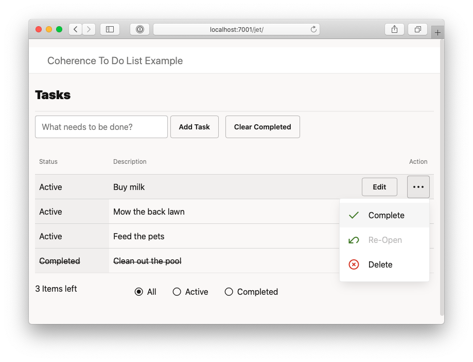

# Coherence To Do List Example Application for Helidon

## Build Instructions

1. Initialize `npm` to download all Node dependencies needed for the React UI:

    ```bash
    cd helidon-server/src/main/web/react
    npm install   
    ```           

2. Build the Helidon Project

Run the following from the project root directory at `helidon-server/`

 ```bash
 mvn clean install
 ```

## Running the Example

### Run the server

```bash  
mvn exec:exec
```
   
### Access the Web UI
  
Access via http://localhost:3000/
   

   
### Run the JavaFX Client

```bash  
cd ../client
mvn javafx:run
```
        


## Build and Run the Oracle JET UI (Optional)

If you wish to run the Oracle JET UI, please carry out the following:

1. Install the JET CLI

    ```bash
    npm install -g @oracle/ojet-cli
    ```   
   
2. Build JET UI
   
    ```bash
    cd server/src/main/web/jet
    npm install
    ojet build
    ```
            
3. Re-Build the Project

    Run the following from the project root directory:

    ```bash
    mvn clean install
    ```          

4. Access the Web UI

   Run the server as mentioned above and access the UI via http://localhost:7001/jet/   
   
   
    
## References

* [Coherence Community Edition](https://github.com/oracle/coherence)
* [Project Helidon](https://helidon.io/)
* [Coherence Community Home Page](https://coherence.community/)
* [Oracle JavaScript Extension Toolkit (JET)](https://www.oracle.com/webfolder/technetwork/jet/index.html)


