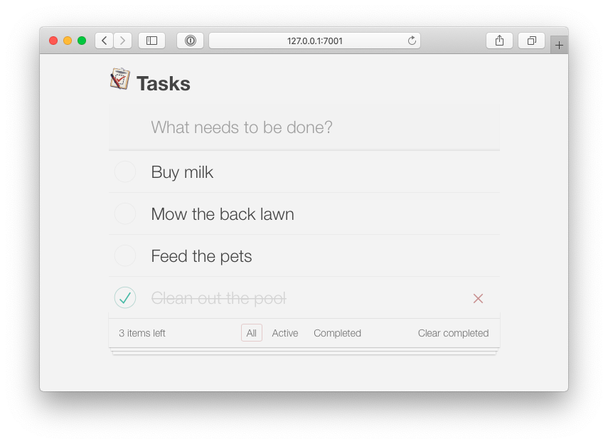
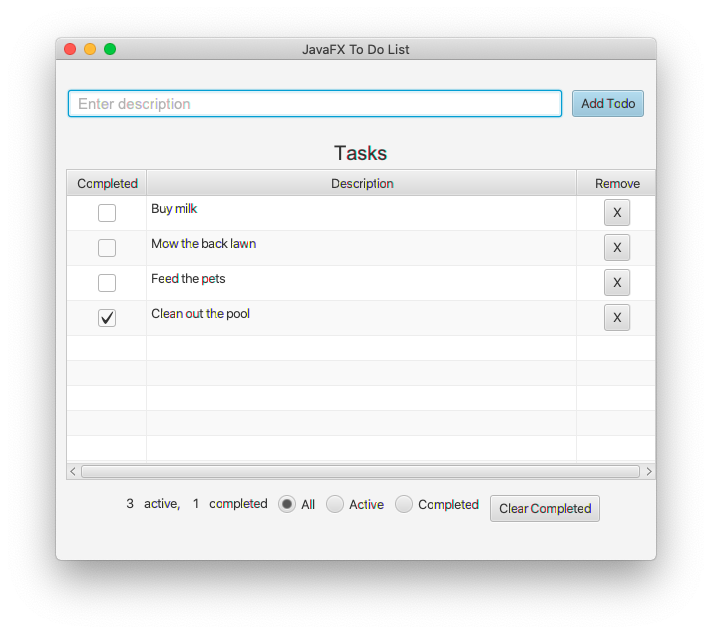

# Coherence To Do List Example Application for Spring Boot

## Build Instructions

Run the following from the project root directory:

```bash
cd java/spring-server
mvn clean package -s ../.mvn/settings.xml
```

## Running the Example

```bash
java -jar target/todo-list-spring-server-23.09.2.jar
```

The Coherence Spring implementation comes with 2
[TaskService](https://github.com/coherence-community/todo-list-example/blob/master/java/spring-server/src/main/java/com/oracle/coherence/examples/todo/server/service/TaskService.java) implementations:

- [SpringDataTaskService](https://github.com/coherence-community/todo-list-example/blob/master/java/spring-server/src/main/java/com/oracle/coherence/examples/todo/server/service/SpringDataTaskService.java)
- [CoherenceTaskService](https://github.com/coherence-community/todo-list-example/blob/master/java/spring-server/src/main/java/com/oracle/coherence/examples/todo/server/service/CoherenceTaskService.java)

By default, the Spring Data-based implementation is used, but you can activate the native
Coherence implementation by enabling the `Coherence` Spring Boot profile:

```bash
java -jar target/todo-list-spring-server-23.09.2.jar --spring.profiles.active=coherence
```

### Access the Web UI

Access via http://localhost:7001/



### Run the JavaFX Client

```bash  
cd ../coherence-client
mvn javafx:run
```



### Query the GraphQL Endpoint

The GraphQL Endpoint is available at: `http://localhost:7001/graphql`. Use one of the following tools to interact wih it:

- [GraphiQL](https://github.com/graphql/graphiql)
- [Insomnia](https://insomnia.rest/download)

For instance, retrieve a collection of tasks using the following query:

```graphql
query {
  tasks(completed: false) {
    id
    description
    completed
    createdAt
    createdAtDate
  }
}
```

To create a task:

```graphql
mutation {
    createTask(description: "My awesome Task!") {
        id
        description
        createdAt
        completed
    }
}

```

To update a task:

```graphql
mutation {
  updateTask(id: "123456", completed: true, description: "updated") {
    completed
    description
  }
}
```

In order to delete a task:

```graphql
mutation {
  deleteTask(id: "123456") {
    id
    description
    completed
    createdAt
    createdAtDate
  }
}
```

In order to delete completed tasks:

```graphql
mutation {
  deleteCompletedTasks {
      id
      description
      completed
      createdAt
      createdAtDate
  }
}
```

For more information on GraphQL and using it with the To Do List example, [please see the here](../graphql.md).

## Run with Docker

Build the image:

```bash
mvn clean package -Pdocker
```

Double-check the image is there:

```bash
docker images
```

You should see the image listed:

```bash
REPOSITORY                                            TAG         IMAGE ID       CREATED          SIZE
ghcr.io/coherence-community/todo-list-spring-server   23.09.2     418e5870adc9   5 minutes ago    275MB
ghcr.io/coherence-community/todo-list-spring-server   latest      418e5870adc9   5 minutes ago    275MB
…
```

Run the docker images and binding to ports `3000` and port `1408`:

```bash
docker run -p 7001:7001 -p 1408:1408 ghcr.io/coherence-community/todo-list-spring-server:latest
```
